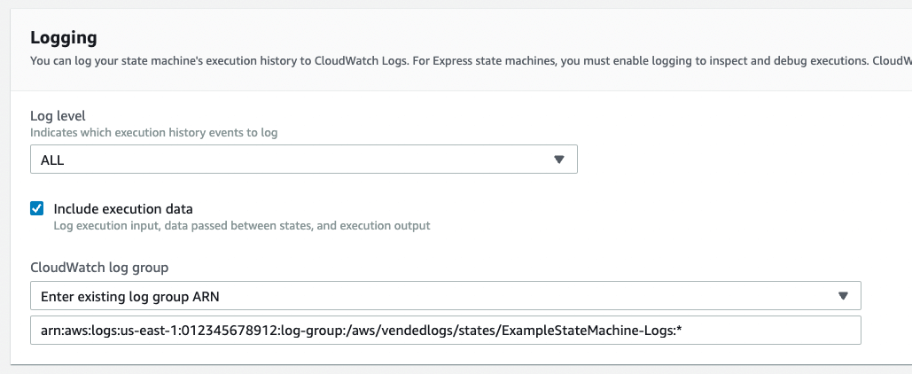
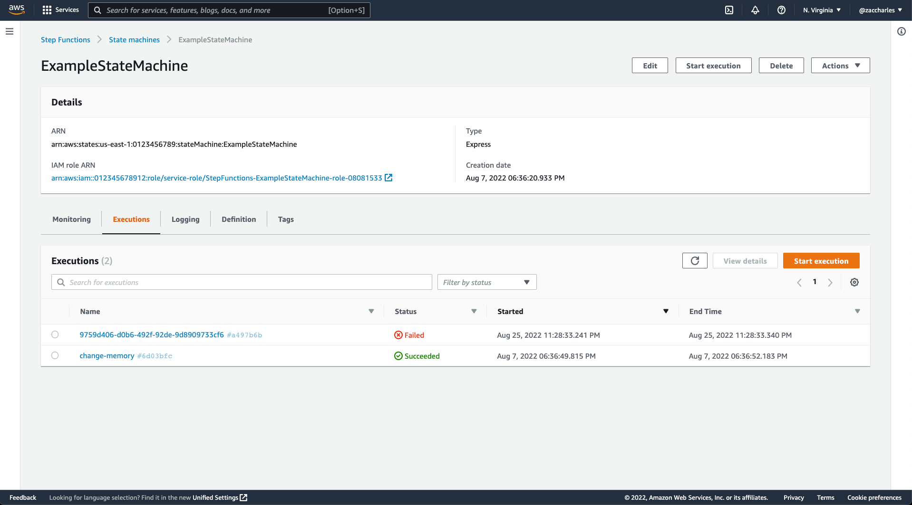
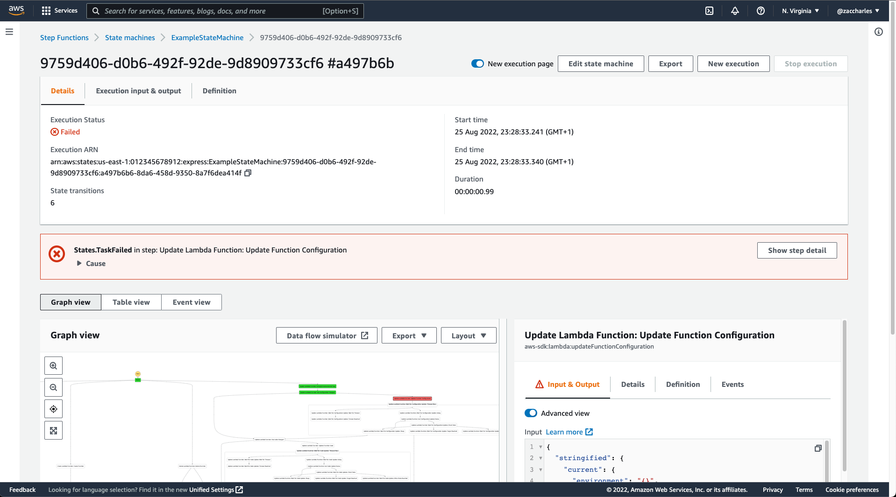

<h1 align="center">
   
  step-functions-express-executions
</h1>

Browser extension that adds execution history and detail for AWS Step Functions express workflows

 

  
   

 

  

## Table of contents
 * [Description](#description)
 * [Requirements](#requirements)
   * [Permissions](#you-need-permissions)
   * [Logging](#logging-turned-on)
 * [Known limitations](#known-limitations)
 * [Screenshots](#screenshots)
 * [Install](#install)
 * [Developing](#developing)
 * [Building](#building)
 * [Contributing](#contributing)
 * [License](#license)

## Description

The AWS Step Functions console provides a powerful UI for debugging state machine executions.

Until now, this power has only been usable when working with standard workflows.

With this browser extension, you'll be able to see execution history and detail for express workflows too! 

When (and only when) the browser is viewing an express Step Function, this extension intercepts requests for execution data and fulfills by fetching data from CloudWatch Logs.

## Requirements

### You need permissions

Requests to CloudWatch Logs are signed by the AWS Console using the principal you're using the AWS Console as. You'll need to have the following permissions to use this extension:
 * `DescribeLogStreams`
 * `GetLogEvents`
 * `FilterLogEvents`

### Logging turned on

Of course, there will be nothing to read in CloudWatch Logs if you don't configure logging.

To get standard-like behaviour, you should set [log level](https://docs.aws.amazon.com/step-functions/latest/dg/cloudwatch-log-level.html) to `ALL` and turn `include execution data` on.

You will see less with log level set to `ERROR` or `FATAL`, but it will still work. The same goes for having `include execution data` turned off; you'll see the path Step Functions took through your state machine, but you won't see data going in and out of states.

Just like usual, you may want to change your logging verbosity temporarily when debugging, then tune it down again.

## Known limitations

**# The executions tab only shows the 20 most recent executions for express functions**
  
_The Step Functions console eagerly tries to load every page of your entire execution history. This behaviour is incompatible with querying CloudWatch Logs as it's simply too slow. This could be overcome with significant effort in the extension or by AWS making a UI change._
  
**# Navigating directly to the execution detail page needs a little help**

_To quickly find the appropriate logs, especially in large log groups, the extension needs to know roughly when the execution happened. To give it a hint, you'll notice the URL has a timestamp like `+1661466513241` appended to it. The extension looks for logs in the 6 minutes before and after the timestamp. Since express workflows can only run for 5 minutes, this will find all the logs. If you want to create links directly to workflow details, I suggest providing the execution start time. This is done automatically when navigating from the execution history._

**# Starting executions from the execution details page**

_If you start an execution from the execution details page, the UI will just sit there trying (and failing) to load data. You just need to go back to the execution history tab and click on your new execution. This could be fixed._

**# The state machine definition is always the current definition**

_The graph and Definition tab on the execution details page both display the state machine. Standard workflow executions store a copy of the state machine definition that was actually executed. This isn't the case for express workflows, so the extension simply reads the current definition. If you've made significant changes to the definition, older executions may no longer be able to be rendered._

## Screenshots
**Executions history**  

  

**Execution details**  

   

  

## Install

I'll eventually submit this to the browser extension stores, but that process is slow (especially Chrome's).  

In the meantime, it's easy enough to install manually by downloading the appropriate extension package below and following the instructions.

### Chromium based browsers:
 * Extract `chrome.zip` into a new folder
 * Go to [chrome://extensions/]()
 * Toggle Developer mode on (top-right corner)
 * Click "Load unpacked"
 * Select the folder you extracted the zip to

### Firefox
 * Go to [about:addons]()  or press Shift-Cmd-A
 * Click the gear (⚙️ ) under the search box
 * Choose _Install add-on from file..._
 * Select `firefox.xpi`  
  
   

|               |             |                  |                     |                  |            |
|:-----------------------------------------------------------------------------------------------------------:|:------------------------------------------------------------------------------------------------------------:|:-----------------------------------------------------------------------------------------------------------:|:-----------------------------------------------------------------------------------------------------------:|:-----------------------------------------------------------------------------------------------------------:|:-----------------------------------------------------------------------------------------------------------:|
| Chrome                                                                                                      | Firefox                                                                                                      | Opera                                                                                                       | Edge                                                                                                        | Brave                                                                                                       | Vivaldi                                                                                                     |
| [Download](https://github.com/zaccharles/step-functions-express-executions/releases/download/v0.0.1/chrome.zip) | [Download](https://github.com/zaccharles/step-functions-express-executions/releases/download/v0.0.1/firefox.zip) | [Download](https://github.com/zaccharles/step-functions-express-executions/releases/download/v0.0.1/opera.zip) | [Download](https://github.com/zaccharles/step-functions-express-executions/releases/download/v0.0.1/chrome.zip) | [Download](https://github.com/zaccharles/step-functions-express-executions/releases/download/v0.0.1/chrome.zip) | [Download](https://github.com/zaccharles/step-functions-express-executions/releases/download/v0.0.1/chrome.zip) |
| (_Coming Soon_)                                                                            | (_Coming Soon_)                                                                          | (_Coming Soon_)                                                                               | (_Coming Soon_)                                                                            | (_Coming Soon_)                                                                            | (_Coming Soon_)                                                                            |

## Developing

Run one of the following commands to start developing. This creates an unpacked extension folder in the `extension` directory. It also starts a hot reload server (which doesn't always work reliable in the AWS Console).
 * `npm run dev:chrome`
 * `npm run dev:firefox`
 * `npm run dev:opera` 

Load the unpacked extension in the browser. Note that the dev build uses a V2 manifest file because the hot reload currently only supports V2. Chrome will show a warning in the "errors" list, but it can be ignored. The production build produces a V3 manifest.

## Building

Run one of the following commands to build the extension. This produces a extension package file in the `extension` directory. For eample, `extension/chrome.zip`.

 * `npm run build:chrome`
 * `npm run build:firefox`
 * `npm run build:opera`

 Dev builds don't run properly without the hot reload server, so if you want to share a build with someone else (or just don't trust my builds), build a proper extension package instead of using an unpacked extension.

## Contributing

PRs welcome, especially for tests lol...

Please file an issue [here](https://github.com/zaccharles/step-functions-express-executions/issues/new) for bugs, missing documentation, or unexpected behavior.

## License

GNU GPLv3 © [Zac Charles](https://twitter.com/zaccharles)
